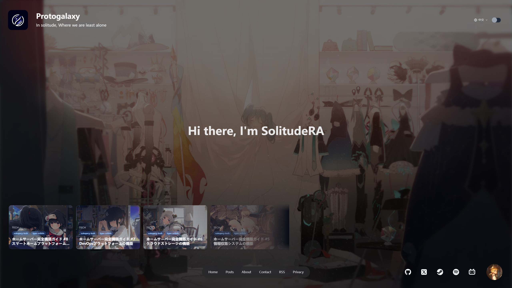
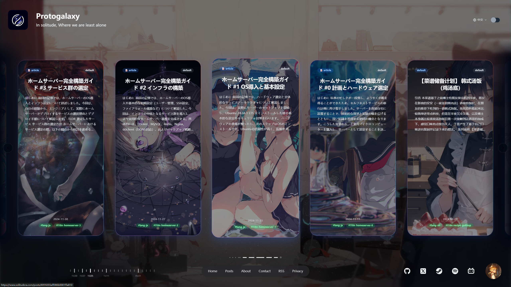
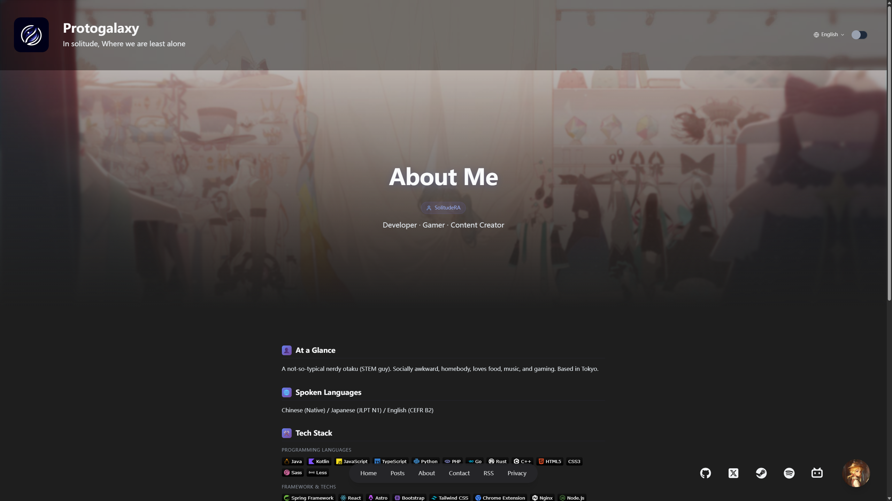
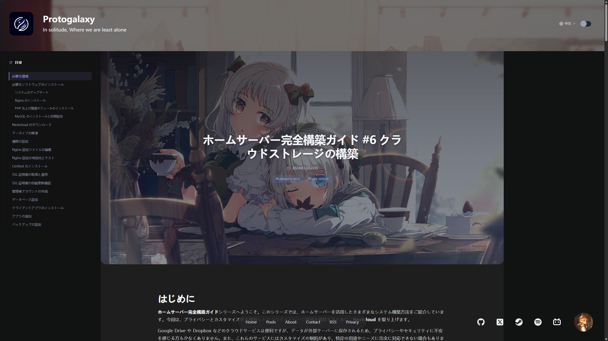

# Solitude Interface


Astro で構築し、Ghost CMS の Content API で駆動するモダンな個人ブログ UI です。

Read this in: [English](../../README.md) | [简体中文](README.zh.md) | 日本語

## 🚀 特徴

- Astro による高性能な静的サイト
- Ghost CMS 連携（Headless）
- **多言語対応（zh/ja/en）**＋自動フォールバック
- レスポンシブデザイン／ダーク・ライト切り替え
- 複数の投稿タイプ表示（記事、ギャラリー、動画、音楽）
- SEO 最適化（hreflang、canonical、html lang）

## Screenshots
### Home

### Post

### About Me

### Post Detail


## 📖 ドキュメント

| ドキュメント | 説明 |
|--------------|------|
| **README.md**（英語） | 利用ガイド - セットアップと投稿運用： [../../README.md](../../README.md) |
| [**DEVELOPMENT.md**](../DEVELOPMENT.md) | 開発者向け - アーキテクチャ、テスト、ワークフロー、コントリビュート |

---

## 🚀 クイックスタート

### 1. 依存関係のインストール

このプロジェクトは **pnpm** を使用します。

```bash
#（推奨）Corepack 経由で pnpm を有効化
corepack enable pnpm

pnpm install
```

> もし `corepack` が利用できない場合は、`npm i -g pnpm` で pnpm をグローバルにインストールできます。

### 2. 環境変数の設定

テンプレートから `.env` を作成します：

```bash
cp .env.example .env
```

`.env` を編集し、Ghost の情報を入力します：

```env
GHOST_URL=https://your-ghost-instance.com
GHOST_CONTENT_KEY=your-content-api-key-here
GHOST_VERSION=v5.0
GHOST_TIMEOUT=5000
SITE_URL=https://your-site.example.com
IMAGE_HOST_URL=
GOOGLE_ANALYTICS_TAG_ID=
```

#### 環境変数

| 変数 | 必須 | 説明 |
|------|------|------|
| `GHOST_URL` | Yes | Ghost インスタンスのベース URL |
| `GHOST_CONTENT_KEY` | Yes | Ghost Content API キー |
| `GHOST_VERSION` | No | Ghost Content API バージョン（デフォルト：`v5.0`） |
| `GHOST_TIMEOUT` | No | Ghost リクエストのタイムアウト（ms、デフォルト：`5000`） |
| `SITE_URL` | Yes | 公開サイト URL（canonical / hreflang 用） |
| `IMAGE_HOST_URL` | No | 任意：画像ホスト/CDN（リモート画像ドメイン許可リスト用、デフォルト：空） |
| `GOOGLE_ANALYTICS_TAG_ID` | No | 任意：Google tag / GA4 Measurement ID（例：`G-XXXX`）。空なら解析無効 |

### 3. Ghost Content API Key を取得する

1. Ghost Admin にログイン
2. **Settings** → **Integrations** を開く
3. **Add custom integration** をクリック
4. **Content API Key** を `.env` に設定

> **Tip**：テスト用に Ghost Demo API も利用できます：
> ```env
> GHOST_URL=https://demo.ghost.io
> GHOST_CONTENT_KEY=22444f78447824223cefc48062
> ```

### 4. 開発サーバーを起動する

```bash
pnpm dev
```

`http://localhost:4321` にアクセスして確認できます。

## よく使うコマンド

| コマンド | 説明 |
|---------|------|
| `pnpm dev` | 開発サーバーを起動 |
| `pnpm build` | 本番ビルドを生成 |
| `pnpm preview` | 本番ビルドをプレビュー |
| `pnpm astro sync` | 型定義を生成（env/schema 変更後に有用） |
| `pnpm astro check` | 型チェック＆Astro プロジェクト検証 |
| `pnpm test` | テストを実行 |
| `pnpm format` | コード整形 |

---

## 📝 コンテンツ公開ガイド

### 分類タグ（Tags）

投稿の分類には **通常タグ（regular tags）** を使います。システムは以下の接頭辞を認識します：

| タグ接頭辞 | 目的 | 例 |
|-----------|------|----|
| `type-` | 表示タイプ | `type-article`, `type-gallery`, `type-video`, `type-music` |
| `category-` | カテゴリ | `category-tech`, `category-life`, `category-design` |
| `series-` | シリーズ | `series-astro-tutorial`, `series-web-dev-basics` |
| *(接頭辞なし)* | 一般タグ | `JavaScript`, `React`, `Photography` |

#### 対応する投稿タイプ

| Type タグ | 表示スタイル |
|----------|--------------|
| `type-article` | 標準記事レイアウト |
| `type-gallery` | カルーセル付きギャラリー |
| `type-video` | 動画プレイヤー埋め込み |
| `type-music` | 音声プレイヤー埋め込み |
| *(default)* | デフォルトカード |

---

## 🌐 多言語コンテンツ

### URL 構造

| ルート | 説明 |
|-------|------|
| `/` | ユーザーの優先言語へ自動リダイレクト |
| `/zh/` | 中国語の投稿一覧 |
| `/ja/` | 日本語の投稿一覧 |
| `/en/` | 英語の投稿一覧 |
| `/zh/p/{key}/` | 中国語記事 |
| `/ja/p/{key}/` | 日本語記事 |
| `/en/p/{key}/` | 英語記事 |

### 多言語に必要なタグ

Ghost では **内部タグ（`#` で始まる internal tags）** を使います：

| 内部タグ | 目的 | 例 |
|----------|------|----|
| `#lang-{locale}` | 投稿言語の指定 | `#lang-zh`, `#lang-ja`, `#lang-en` |
| `#i18n-{key}` | 翻訳グループ識別子 | `#i18n-intro-to-solitude` |

> **注意**：Ghost Content API では内部タグ `#xxx` は slug 形式 `hash-xxx` に変換されます。

### 手順：多言語投稿の作成

**重要**：各言語版は Ghost 上で**別々の投稿（別 Post）**として作成します。同じ `#i18n-{key}` タグで関連付けます。

#### Step 1：翻訳グループ key を決める

例：`astro-guide`。この key は以下で使います：
- `#i18n-astro-guide` タグ（全言語版を紐付け）
- URL：`/zh/p/astro-guide`、`/ja/p/astro-guide`、`/en/p/astro-guide`

#### Step 2：中国語版を作る

Ghost Admin で新規投稿を作成：
1. 中国語で本文を書く
2. **Post settings**（歯車）を開く
3. **Tags** までスクロール
4. 以下のタグを追加：
   - `#lang-zh`（言語タグ。`#` を忘れない）
   - `#i18n-astro-guide`（翻訳グループタグ）
   - `type-article`（任意：タイプ）
   - `category-tech`（任意：カテゴリ）
5. 公開する

#### Step 3：日本語版を作る

Ghost で **別の新規投稿**として作成：
1. 日本語で本文を書く
2. 以下のタグを追加：
   - `#lang-ja` ← 言語が異なる
   - `#i18n-astro-guide` ← **同じ** i18n key
   - `type-article`, `category-tech`（他言語版と揃える）
3. 公開する

#### Step 4：英語版を作る

さらに **別の新規投稿**として作成：
1. 英語で本文を書く
2. 以下のタグを追加：
   - `#lang-en` ← 言語が異なる
   - `#i18n-astro-guide` ← **同じ** i18n key
   - `type-article`, `category-tech`（他言語版と揃える）
3. 公開する

#### 結果

Ghost 上に 3 つの独立投稿ができ、`#i18n-astro-guide` で関連付けられます：
- 中国語：`/zh/p/astro-guide`
- 日本語：`/ja/p/astro-guide`
- 英語：`/en/p/astro-guide`

記事ページの言語スイッチャーから相互に切り替え可能です。

### 完全な例

| タイトル | Tags |
|---------|------|
| 「Astro 入门指南」（中国語） | `#lang-zh`, `#i18n-astro-guide`, `type-article`, `category-tech` |
| 「Astro入門ガイド」（日本語） | `#lang-ja`, `#i18n-astro-guide`, `type-article`, `category-tech` |
| 「Getting Started with Astro」（英語） | `#lang-en`, `#i18n-astro-guide`, `type-article`, `category-tech` |

### フォールバック（Fallback）動作

- 対応言語の投稿が存在しない場合、デフォルト言語（中国語）を表示
- フォールバック中である旨のバナーを表示
- 言語スイッチャーで利用可／不可が分かる

---

## 🛠️ 開発者向け

[**docs/DEVELOPMENT.md**](../DEVELOPMENT.md) に以下をまとめています：

- 🔧 技術スタック＆プロジェクト構成
- 🧞 利用可能なコマンド一覧
- 📋 テストガイド（Unit / Integration）
- 🏗️ アーキテクチャ＆コード参照

---

## 📄 ライセンス

本プロジェクトはオープンソースで、[MIT License](../../LICENSE) で提供されます。
