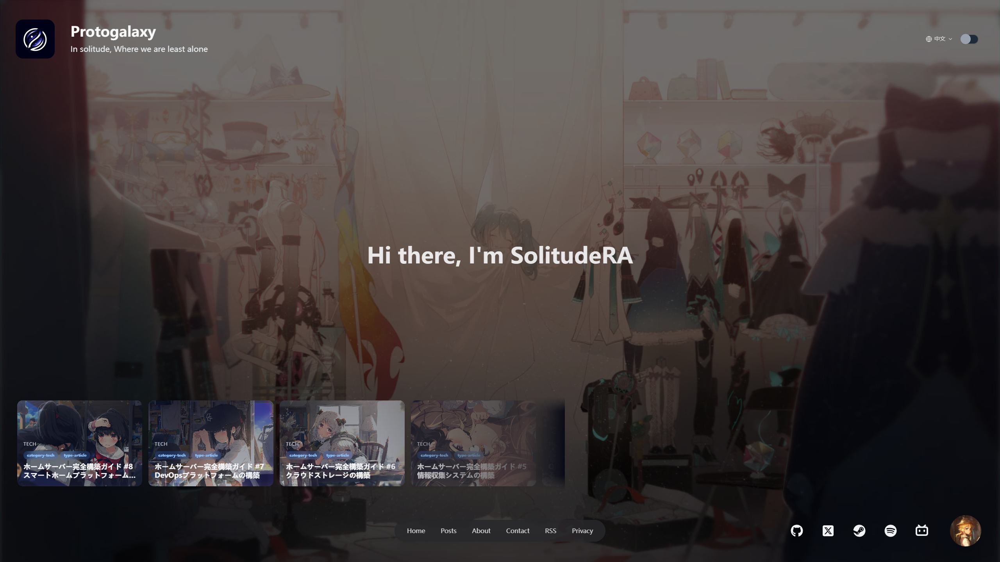
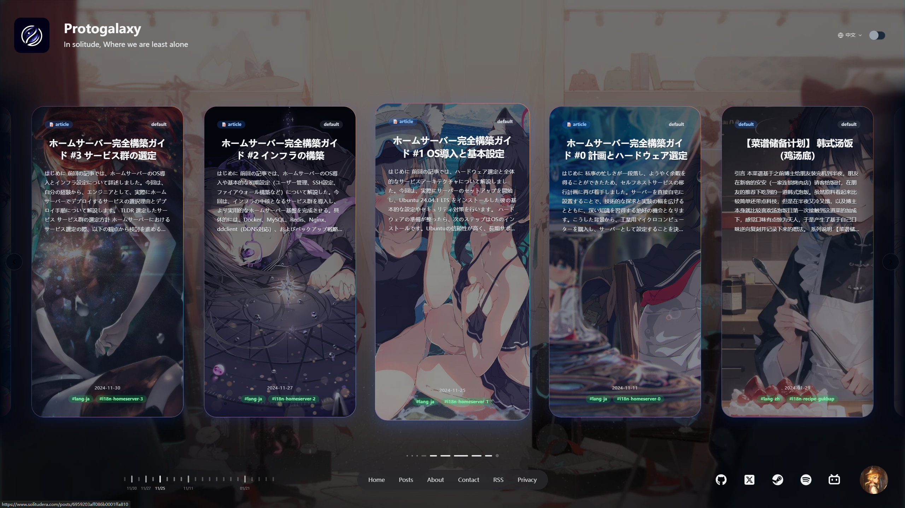
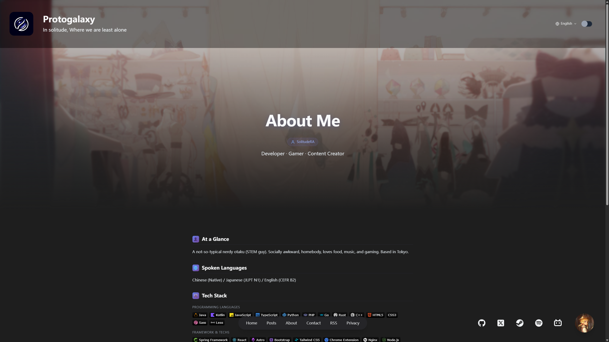
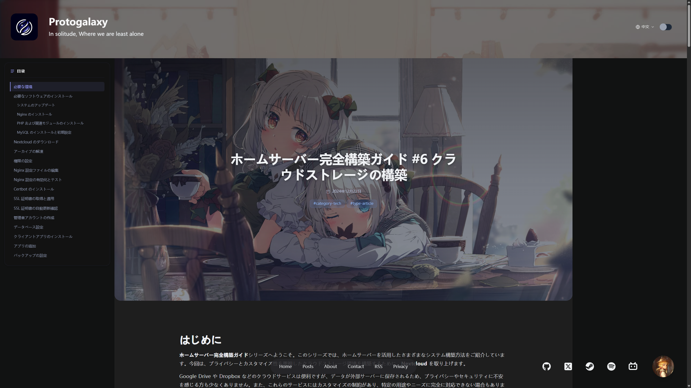

# Solitude Interface


Astro で構築し、Ghost CMS の Content API で駆動するモダンな個人ブログ UI です。

**[ライブデモ](https://www.solitudera.com)** · [ドキュメント](../DEVELOPMENT.md)

> **このリポジトリについて** —— これは私の個人サイト（[solitudera.com](https://www.solitudera.com)）のソースで、主にショーケース・参考用として公開しています。**再利用可能なテンプレートとして保守しているわけではなく**、issue や Pull Request も積極的には扱っていません。MIT ライセンスなので、自由に閲覧・fork してください。

Read this in: [English](../../README.md) | [简体中文](README.zh.md) | 日本語

---

## 目次

- [ハイライト](#ハイライト)
- [スクリーンショット](#スクリーンショット)
- [技術スタックとアーキテクチャ](#技術スタックとアーキテクチャ)
- [ローカルで動かす](#ローカルで動かす)
- [セルフホスティングとコンテンツガイド](#セルフホスティングとコンテンツガイド)
- [ライセンス](#ライセンス)

---

## ハイライト

- **Astro 5 静的サイト + React アイランド** —— コンテンツはビルド時に事前レンダリングし、インタラクションは必要な箇所だけハイドレート（`client:idle` / `client:visible` / `client:load`）。
- **型付き Ghost CMS データ層** —— ヘッドレス Ghost Content API クライアント（リトライ + タイムアウト付き）→ 型付きアダプター → キャッシュ・グルーピング済みの投稿。外部データ境界でランタイム検証を行います。
- **多言語（zh / ja / en）** —— 投稿をタグ/slug で言語横断にグルーピングし、3 段階のフォールバックを提供。`hreflang`・`canonical`・ページ単位の `html lang` で SEO に対応。
- **手作業で調整したモーション** —— バネ駆動の投稿タイムラインと、ビューポート最下層のアンビエント進捗バー（臨界減衰の rAF バネ + 速度連動のグロー）。すべて `prefers-reduced-motion` に追従します。
- **OKLch デュアルテーマのデザインシステム** —— 明暗トークンを知覚的に均一な色空間で定義し、Tailwind v4 の CSS-first `@theme` 経由で接続。
- **信頼性のためのエンジニアリング** —— 厳格な TypeScript（`exactOptionalPropertyTypes`）、ユニット + 統合テスト（Vitest）、多段の CI（lint / test / typecheck / build）。

アーキテクチャ、コード参照、テストガイドは **[DEVELOPMENT.md](../DEVELOPMENT.md)** を参照してください。

---

## スクリーンショット

<details>
<summary>クリックして展開</summary>

### Home



### Post



### About Me



### Post Detail



</details>

---

## 技術スタックとアーキテクチャ

Astro 5（SSG）· React 19 アイランド · Jotai · Tailwind v4 · Ghost CMS（ヘッドレス）· shiki · motion · TypeScript（厳格）。

データは一方向に流れます：**Ghost → 型付きクライアント → アダプター → キャッシュ済み投稿 → ページ（SSG）→ 表示用コンポーネント**。全体像——プロジェクト構成、タグ / i18n システム、テスト戦略——は **[DEVELOPMENT.md](../DEVELOPMENT.md)** にまとめています。

---

## ローカルで動かす

コードを覗いてみたいだけ、という場合は公開の Ghost Demo API を使うのが最短です。アカウントは不要です：

```bash
corepack enable pnpm   # または：npm i -g pnpm
pnpm install
cp .env.example .env
pnpm dev               # http://localhost:4321
```

続いて `.env` を Ghost demo に向けます：

```env
GHOST_URL=https://demo.ghost.io
GHOST_CONTENT_KEY=22444f78447824223cefc48062
SITE_URL=http://localhost:4321
```

> 便利なチェック：`pnpm check`（lint + フォーマット + 型チェック）と `pnpm test:run`（ユニットテスト）。コマンド一覧は [DEVELOPMENT.md](../DEVELOPMENT.md) を参照してください。

---

## セルフホスティングとコンテンツガイド

本リポジトリは私のサイトの実装そのものでもあるため、運用に必要な設定はすべてここにあります —— 自分の Ghost インスタンスで動かしたい場合や、コンテンツのモデリングを知りたい場合にどうぞ。

<details>
<summary><strong>設定・環境変数・コンテンツ公開・多言語・デプロイ</strong></summary>

### 環境変数の設定

`.env` を編集し、あなた自身の Ghost インスタンスの情報を入力します：

```env
GHOST_URL=https://your-ghost-instance.com
GHOST_CONTENT_KEY=your-content-api-key-here
GHOST_VERSION=v5.0
GHOST_TIMEOUT=5000
SITE_URL=https://your-site.example.com
IMAGE_HOST_URL=
GOOGLE_ANALYTICS_TAG_ID=
```

#### 必須

| 変数                | 説明                                      |
| ------------------- | ----------------------------------------- |
| `GHOST_URL`         | Ghost インスタンスのベース URL            |
| `GHOST_CONTENT_KEY` | Ghost Content API キー                    |
| `SITE_URL`          | 公開サイト URL（canonical / hreflang 用） |

#### 任意

| 変数                      | デフォルト | 説明                                                                                    |
| ------------------------- | ---------- | --------------------------------------------------------------------------------------- |
| `GHOST_VERSION`           | `v5.0`     | Ghost Content API バージョン                                                            |
| `GHOST_TIMEOUT`           | `5000`     | Ghost リクエストのタイムアウト（ms）                                                    |
| `IMAGE_HOST_URL`          | -          | 画像ホスト/CDN（リモート画像ドメイン許可リスト用）。単一またはカンマ区切りで複数 URL 可 |
| `GOOGLE_ANALYTICS_TAG_ID` | -          | Google tag / GA4 Measurement ID（例：`G-XXXX`）。空なら解析無効                         |
| `CF_ACCESS_CLIENT_ID`     | -          | Cloudflare Access Service Token Client ID（Ghost が CF Access で保護されている場合）    |
| `CF_ACCESS_CLIENT_SECRET` | -          | Cloudflare Access Service Token Client Secret                                           |

#### Ghost Content API Key を取得する

1. Ghost Admin にログイン
2. **Settings** → **Integrations** を開く
3. **Add custom integration** をクリック
4. **Content API Key** を `.env` に設定

### Cloudflare Access（任意）

Ghost インスタンスが [Cloudflare Access](https://developers.cloudflare.com/cloudflare-one/policies/access/) で保護されている場合、API へアクセスするには **Service Token** の設定が必要です：

1. **Service Token を作成**（Cloudflare Zero Trust）：**Access** → **Service Auth** → **Service Tokens** → **Create Service Token** で **Client ID** と **Client Secret** をコピー。
2. **`.env` に設定**：`CF_ACCESS_CLIENT_ID` / `CF_ACCESS_CLIENT_SECRET`。
3. **対象の Access Application に Service Auth ポリシーを追加**し、その token を選択。

> **補足**：本プロジェクトが実装しているのは **Service Token 認証のみ**です。2 つの変数を**両方**設定したときに限り `CF-Access-Client-Id` / `CF-Access-Client-Secret` ヘッダーを付与します（片方だけなら送信されず、警告が出ます）。

以下は **Cloudflare ダッシュボード側のポリシーで、本プロジェクトのコードは実装も参照もしません** —— Content API リクエストを通すためのもので、追加の保護を入れている場合のみ設定します：

- **Bot Fight Mode**：Cloudflare → Security → WAF → Custom rules で、URI Path が `/ghost/api/content/` で始まるルールを作成し、Action = Skip → All Super Bot Fight Mode rules。
- **Zero Trust Access Bypass**：Zero Trust → Access → Applications で `your-ghost-domain.com/ghost/api/content/*` 用のアプリを追加し、ポリシーを **Bypass** に設定。

### コンテンツ公開

投稿の分類には **通常タグ（regular tags）** を使います。システムは以下の接頭辞を認識します：

| タグ接頭辞     | 目的       | 例                                                         |
| -------------- | ---------- | ---------------------------------------------------------- |
| `type-`        | 表示タイプ | `type-article`, `type-gallery`, `type-video`, `type-music` |
| `category-`    | カテゴリ   | `category-tech`, `category-life`, `category-design`        |
| `series-`      | シリーズ   | `series-astro-tutorial`, `series-web-dev-basics`           |
| _(接頭辞なし)_ | 一般タグ   | `JavaScript`, `React`, `Photography`                       |

| Type タグ      | 表示スタイル             |
| -------------- | ------------------------ |
| `type-article` | 標準記事レイアウト       |
| `type-gallery` | カルーセル付きギャラリー |
| `type-video`   | 動画プレイヤー埋め込み   |
| `type-music`   | 音声プレイヤー埋め込み   |
| _(default)_    | デフォルトカード         |

### 多言語コンテンツ

| ルート         | 説明                                 |
| -------------- | ------------------------------------ |
| `/`            | ユーザーの優先言語へ自動リダイレクト |
| `/zh/`         | 中国語の投稿一覧                     |
| `/ja/`         | 日本語の投稿一覧                     |
| `/en/`         | 英語の投稿一覧                       |
| `/zh/p/{key}/` | 中国語記事                           |
| `/ja/p/{key}/` | 日本語記事                           |
| `/en/p/{key}/` | 英語記事                             |

Ghost では **内部タグ（`#` で始まる internal tags）** を使います：

| 内部タグ         | 目的               | 例                                 |
| ---------------- | ------------------ | ---------------------------------- |
| `#lang-{locale}` | 投稿言語の指定     | `#lang-zh`, `#lang-ja`, `#lang-en` |
| `#i18n-{key}`    | 翻訳グループ識別子 | `#i18n-intro-to-solitude`          |

> **注意**：Ghost Content API では内部タグ `#xxx` は slug 形式 `hash-xxx` に変換されます。

**投稿 slug の命名規約（予約プレフィックス）** —— 内部タグに加えて、**Ghost の投稿 slug** から直接記事のアイデンティティを導出する仕組みもあり、規約は `{locale}-{key}` です：

| 投稿 slug         | 解析結果                                                                |
| ----------------- | ----------------------------------------------------------------------- |
| `ja-homeserver-8` | locale = `ja`、翻訳グループ key = `homeserver-8` → `/ja/p/homeserver-8` |
| `en-blog-project` | locale = `en`、翻訳グループ key = `blog-project` → `/en/p/blog-project` |

> **重要：`zh-` / `ja-` / `en-` は予約された slug プレフィックスです。** 有効な言語コード＋ハイフンで始まる slug は、`#lang-*` / `#i18n-*` タグが無くても、その言語の多言語投稿として解析されます。そのため、**通常（非多言語）の投稿に `zh-…` / `ja-…` / `en-…` のような slug を付けないでください**。誤って翻訳グループにまとめられ、誤った `/{locale}/p/{key}` ルートや hreflang が生成されます。投稿に `#lang-*` タグがある場合：**言語**はタグを優先し slug プレフィックスはフォールバック、**翻訳グループ key** は slug を優先し `#i18n-*` タグをフォールバックとします。

**多言語投稿の作成** —— 各言語版は Ghost 上で**別々の投稿（別 Post）**として作成し、同じ `#i18n-{key}` タグで関連付けます：

1. 翻訳グループ key を決める（例：`astro-guide`）—— `#i18n-astro-guide` タグと URL `/{locale}/p/astro-guide` で使います。
2. 中国語版を作成：本文を書き、タグ `#lang-zh` と `#i18n-astro-guide`（任意で `type-article`、`category-tech`）を付けて公開。
3. 日本語版を作成（別の独立した投稿）：タグ `#lang-ja` と**同じ** `#i18n-astro-guide` を付けて公開。
4. 英語版を作成（別の独立した投稿）：タグ `#lang-en` と**同じ** `#i18n-astro-guide` を付けて公開。

3 つの投稿が `/zh/p/astro-guide`、`/ja/p/astro-guide`、`/en/p/astro-guide` となり、記事ページの言語スイッチャーから相互に切り替えできます。

| タイトル                               | Tags                                                             |
| -------------------------------------- | ---------------------------------------------------------------- |
| 「Astro 入门指南」（中国語）           | `#lang-zh`, `#i18n-astro-guide`, `type-article`, `category-tech` |
| 「Astro入門ガイド」（日本語）          | `#lang-ja`, `#i18n-astro-guide`, `type-article`, `category-tech` |
| 「Getting Started with Astro」（英語） | `#lang-en`, `#i18n-astro-guide`, `type-article`, `category-tech` |

**フォールバック（Fallback）**：対応言語の投稿が無い場合はデフォルト言語（中国語）を表示。デフォルト言語も無い場合は `LOCALES` の順序（`zh`、`ja`、`en`）で利用可能な版を表示します —— この順序は load-bearing です（中国語が無いときは英語より日本語が優先）。フォールバック中である旨のバナーを表示します。

### デプロイ

これは純粋な静的サイト（Astro SSG）です。`pnpm build` は `dist/` を出力し、任意の静的ホスト（例：Cloudflare Pages）に配置できます。デプロイ先のビルド環境にもローカルの `.env` と同じ環境変数を設定してください：静的生成は**ビルド時**に行われ、Ghost のコンテンツはビルド時に取得・事前レンダリングされるため、認証情報が `dist/` に含まれることはありません。

</details>

---

## ライセンス

MIT —— [LICENSE](../../LICENSE) を参照。自由に fork・改変してください。
